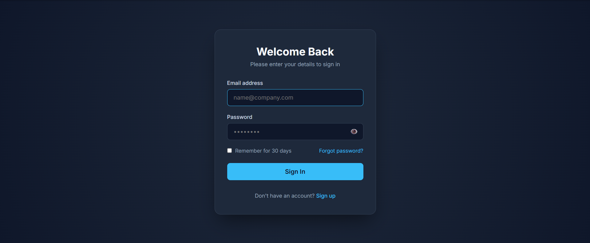
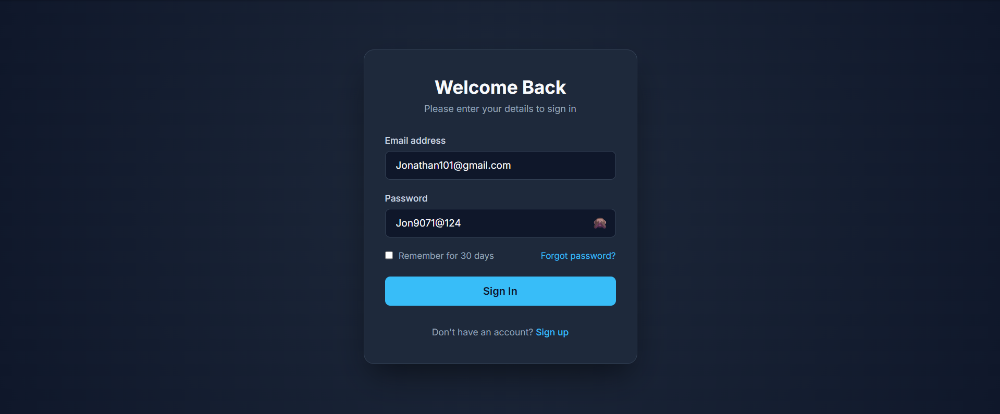

# 🔐 Modern Login Page UI

A modern, responsive, and user-friendly login interface developed as part of the **Synent Technologies Web Development Internship**. The project focuses on creating a clean authentication interface with an intuitive user experience using HTML5, CSS3, and JavaScript.

---

## 🚀 Features

- 📧 **Email & Password Fields**: Custom styled input components with interactive focus states.
- 👁️ **Show/Hide Password**: Toggle password visibility dynamically using JavaScript [source: 1].
- ☑️ **Remember Me & Forgot Password**: Standard authentication UX elements included [source: 1].
- 🎨 **Modern Card Aesthetic**: Centered card layout with a sleek dark radial background gradient.
- 📱 **Fully Responsive Layout**: Fluid design optimized for mobile, tablet, and desktop viewports [source: 1].
- ⚡ **Client-side Form Handling**: Basic form submission and DOM event handling [source: 1].

---

## 🛠️ Technologies Used

- **HTML5**: Semantic document structuring and form elements [source: 1]
- **CSS3**: Modern Flexbox layout, custom input styling, responsive design, and CSS transitions [source: 1]
- **JavaScript (ES6)**: DOM manipulation, password visibility toggle logic, and event listeners [source: 1]

---

## 📁 Project Structure

```text
synent-task3-loginui-vishvjit/
│
├── assets/
│   └── images/
│       ├── login-page.png
│       └── password-visible.png
│
├── index.html
├── style.css
├── script.js
└── README.md

## 📸 Screenshots

### Login Page


### Password Visibility Enabled


## ▶️ How to Run

1. Clone or download the repository.
2. Open the project folder.
3. Open `index.html` in your preferred web browser.
4. Interact with the login form and test the available features.
```[cite: 1]

## 🎯 Learning Outcomes

- Building responsive web layouts[cite: 1]
- Creating modern authentication interfaces[cite: 1]
- Form validation using JavaScript[cite: 1]
- DOM manipulation[cite: 1]
- Improving user experience with interactive UI elements[cite: 1]
- Organizing project files professionally[cite: 1]

---

## 👨‍💻 Author

**Vishvjit Rajput**  
GitHub: [@Sabii01](https://github.com/Sabii01)